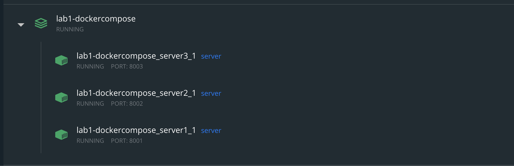

## ЛР1 - Реализация запуска приложения с использованием Docker по предмету "Облачные технологии"

#### Для реализации данной лабораторной работы требуется:
- Пройти interactive tutorial по Docker
- Создать веб-сервис
- Создать Dockerfile и запустить приложение в Docker
- Создать docker-compose.yaml и запустить несколько контейнеров с использованием docker-compose
#### Для сдачи работы требуется предоставить ссылку на git репозиторий в котором находятся:
- Исходные коды приложения
- Dockerfile, docker-compose.yaml и скрипты запуска с описанием

#### Реализация

За основу была взята первая лабораторная работа по предмету "РАЗРАБОТКА ВЫСОКОНАГРУЖЕННЫХ WEB-ПРИЛОЖЕНИЙ".
Docker и Docker-compose предварительно установлены.

1. Сформирован образ
 ```docker build -t "server" .```
2. Сформирован docker-compose.yml, где в services указываются запускаемые контейнеры:
```
version: "3.3"
services:
    server1:
        image: server
        ports: 
        - "8001:8000"
    server2:
        image: server
        ports: 
        - "8002:8000"        
    server3:
        image: server
        ports: 
        - "8003:8000"
```
3. При помощи `docker-compose up` запускаем проект

С помощью такой команды можно вывести список контейнеров:
```
docker-compose ps
```
4. Для остановки и удаления контейнеров используется команда
```
docker-compose down
```
